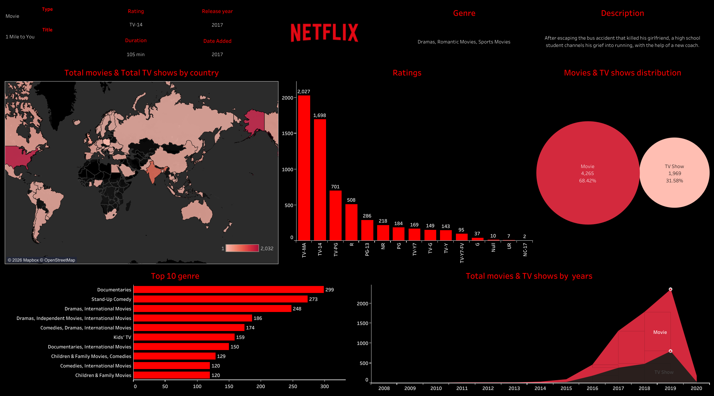

# Netflix Tableau Dashboard

<p align="center">
  
</p>

An interactive Tableau dashboard providing in-depth analysis and visual insights into Netflix's catalog of movies and TV shows.

---

## 📊 Dashboard Overview




---

## 🎯 Key Insights & Visualizations

- **Content Breakdown:** Ratio and count comparison between movies and TV shows.
- **Global Distribution:** Geographic concentration of media production and country-wise catalog volume.
- **Temporal Trends:** Historical trends in release years vs. when titles were added to the platform.
- **Audience & Ratings:** Distribution of age ratings (TV-MA, TV-14, PG-13, R, etc.) across different categories.
- **Top Genres:** Analysis of dominant genres and categories across the catalog.

---

## 📁 Repository Structure

```text
Netflix-Tableau-Dashboard/
│
├── Dataset/
│   └── netflix_titles.csv       # Source catalog dataset
│
├── Images/
│   ├── Netflix logo.png         # Brand logo asset
│   └── Netflix_Dashboard.png    # Preview screenshot of the dashboard
│
├── Netlfix _Dashboard.twbx       # Packaged Tableau workbook
└── README.md                    # Project documentation
```

---

## 💾 Dataset Details

The analysis uses `Dataset/netflix_titles.csv`, which includes metadata such as:

| Column | Description |
| :--- | :--- |
| `show_id` | Unique identifier for each entry |
| `type` | Classification (`Movie` or `TV Show`) |
| `title` | Name of the movie or show |
| `director` | Content director(s) |
| `cast` | Production cast |
| `country` | Country/countries of production |
| `date_added` | Date added to the platform |
| `release_year` | Original release year |
| `rating` | Content advisory / maturity rating |
| `duration` | Length (minutes for movies, seasons for TV shows) |
| `listed_in` | Catalog genre classifications |

---

## 🚀 Getting Started

### Prerequisites
- [Tableau Desktop](https://www.tableau.com/products/desktop) or the free [Tableau Reader](https://www.tableau.com/products/reader).

### Running the Project
1. Clone this repository:
   ```bash
   git clone https://github.com/<your-username>/Netflix-Tableau-Dashboard.git
   cd Netflix-Tableau-Dashboard
   ```
2. Open `Netlfix _Dashboard.twbx` directly in Tableau Desktop or Tableau Reader. The `.twbx` packaged format includes the underlying extracted data.
